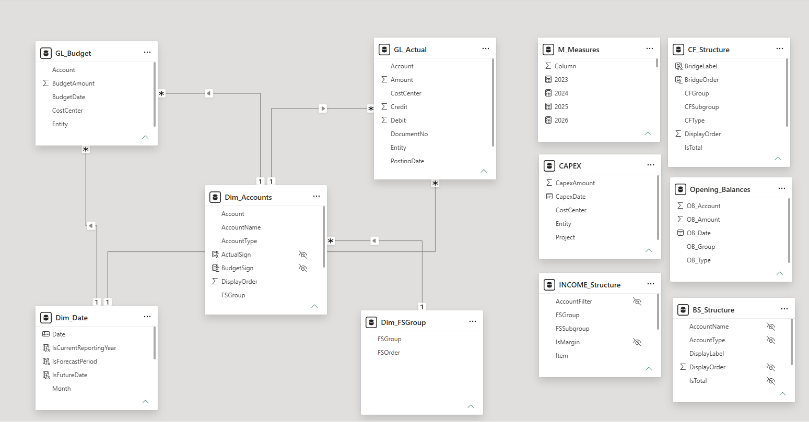

# Data Model

The semantic model behind the Executive Financial Dashboard is a star schema, built to keep three
financial statements (income statement, balance sheet, cash flow) internally consistent and fast enough
to run inside Power BI Service's per-visual memory limit.

## Design principles

- **One fact table per source, not per statement.** Actuals and budget are separate fact tables because
  they arrive from different processes on different cadences. The three financial statements are all
  derived from the same two fact tables plus a small set of *structure* tables — there is no separate
  "balance sheet fact" or "cash flow fact."
- **Single-direction filtering only.** Every relationship filters from dimension to fact, many-to-one.
  There are no bidirectional relationships anywhere in the model. This is a deliberate trade-off:
  it costs a small amount of DAX (occasional `CROSSFILTER` when a calculation genuinely needs the
  reverse direction) in exchange for filter propagation that is predictable and cheap to reason about at
  scale — the property that mattered most once the statement matrices started approaching the Service
  memory limit.
- **Sign convention resolved once, at the dimension.** `Dim_Accounts` carries a precomputed sign column
  used by the base `Actual`/`Budget` measures, so presentation logic (assets and liabilities shown
  positive, one deliberate exception) never has to be reimplemented per statement.
- **Structure tables drive layout, not hardcoded visuals.** Row order, indentation and subtotal placement
  for each statement live in a structure table, not in the report canvas. Reordering a line item on the
  income statement is a data change, not a visual rebuild.

## Fact tables

| Table | Grain | Role |
|---|---|---|
| `GL_Actual` | Account &times; posting date | General ledger actuals, posted through April 2026 |
| `GL_Budget` | Account &times; budget date | Budget postings through December 2026, positive magnitude by convention |
| `CAPEX` | Cost center &times; date | Capital expenditure detail, own local date table |
| `Opening_Balances` | Account &times; year | Year-end balance sheet snapshots; anchors point-in-time balances for accounts receivable, inventory and prepaid expenses so they don't rely on a naive lifetime cumulative sum |

## Dimension tables

| Table | Role |
|---|---|
| `Dim_Accounts` | Chart of accounts, with `FSGroup` mapping and the precomputed sign column consumed by the base `Actual`/`Budget` measures |
| `Dim_Date` | Conformed calendar for both GL fact tables — the single source of time intelligence |
| `Dim_FSGroup` | Financial statement grouping above the account level |

## Structure tables

| Table | Drives |
|---|---|
| `INCOME_Structure` | Row order, hierarchy and margin flags for the income statement matrix |
| `BS_Structure` | Row order and totals for the balance sheet matrix |
| `CF_Structure` | Bridge step order for the cash flow waterfall |

Each structure table is read by a corresponding "report value" measure (`FS Report Value`,
`BS_ReportValue`, `CF_ReportValue`) that resolves what to display purely from row context. Changing a
statement's layout is a structure-table edit, never a DAX or visual change.

## Relationships and filter direction

All relationships are many-to-one, single direction, filtering from dimension into fact:

| From (many) | To (one) |
|---|---|
| `GL_Actual[Account]` | `Dim_Accounts[Account]` |
| `GL_Budget[Account]` | `Dim_Accounts[Account]` |
| `GL_Actual[PostingDate]` | `Dim_Date[Date]` |
| `GL_Budget[BudgetDate]` | `Dim_Date[Date]` |
| `Dim_Accounts[FSGroup]` | `Dim_FSGroup[FSGroup]` |
| `CAPEX[CapexDate]` | auto local date table |
| `Opening_Balances[OB_Date]` | auto local date table |

`M_Measures` is a single-column, table-less container that holds the 300+ measure library, organized by
display folder rather than by physical table.

## Known model debt

Two auto-generated local date tables exist for `CAPEX` and `Opening_Balances` because Power BI's auto
date/time setting is still enabled in the file. They duplicate what `Dim_Date` already provides and are
flagged for cleanup in the [Handoff Document](../Documentation/Handoff%20Document%20-%20Executive%20Financial%20Dashboard%20%28EN%29.pdf).

For the full list of tables, the complete relationship inventory, and the conventions that keep the
statements balanced, see the [Handoff Document](../Documentation/Handoff%20Document%20-%20Executive%20Financial%20Dashboard%20%28EN%29.pdf) —
this page summarizes it for a first read; that document is the maintained source of truth.
