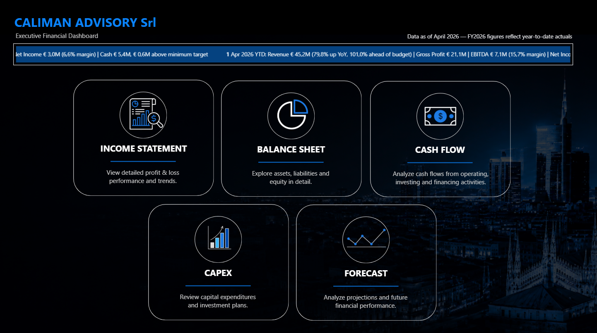
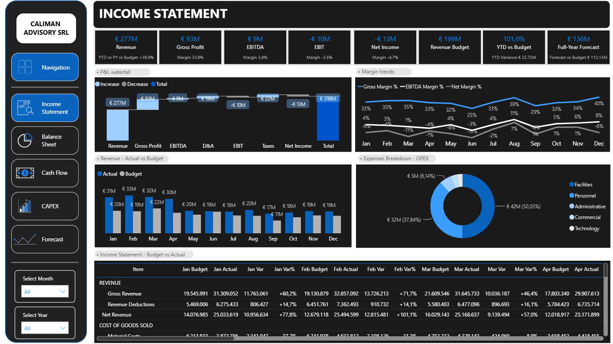
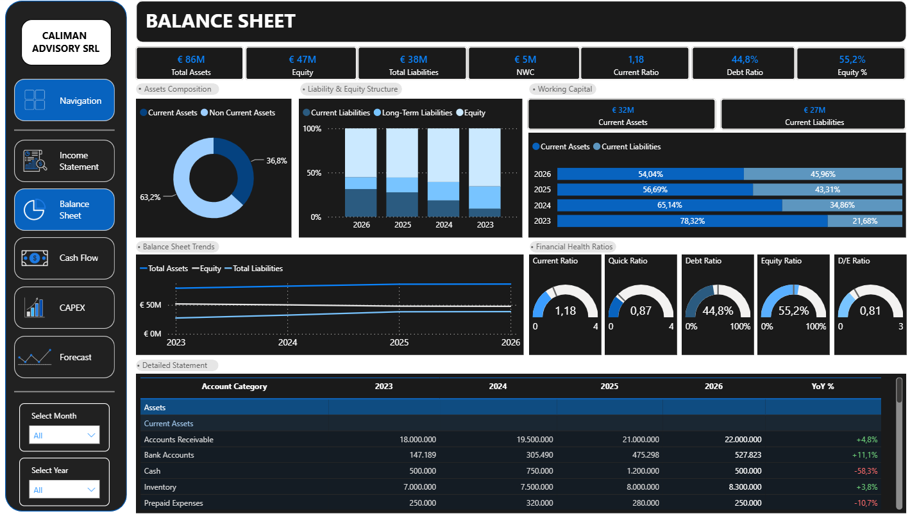
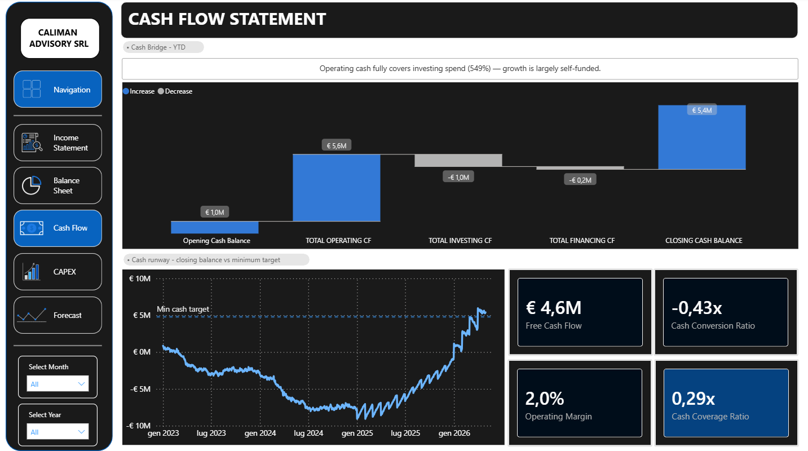
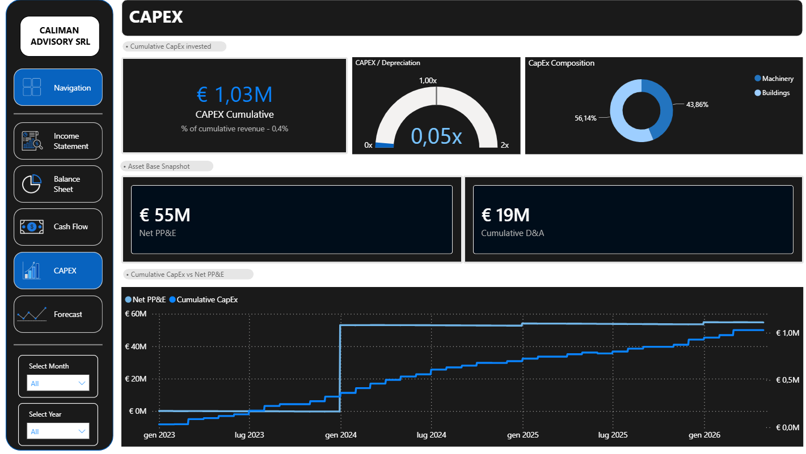
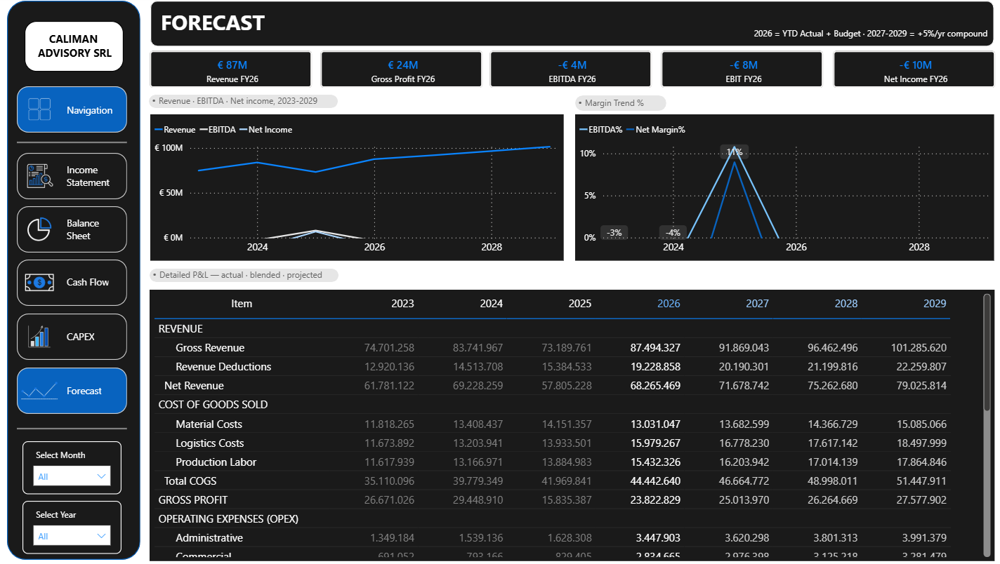

<div align="center">

# Executive Financial Reporting Project
### Power BI Semantic Model &nbsp;·&nbsp; Executive Reporting &nbsp;·&nbsp; FP&A

**Caliman Advisory SRL — Year-to-Date Financial Performance, January–April 2026**

[**▶ Open the Live Dashboard**](https://app.powerbi.com/view?r=eyJrIjoiZWQ4MzExZGUtNjg2MS00MDI1LTliODAtMjQxMDU5OTc4MDJhIiwidCI6IjhhNzA1MDNmLTI5N2UtNGRiZC05M2E2LTZkZDQ2OWFhOWJhZSJ9&embedImagePlaceholder=true)

</div>

---

> **Synthetic data notice.** Every figure in this repository — the dashboard, the reports, the
> presentation decks — is generated from a synthetic general ledger built to behave like a real
> mid-sized company's books, imperfections included. It does not describe any real entity. It exists to
> demonstrate financial modeling, FP&A analysis and executive reporting craft end to end.

## Executive summary

This repository packages a complete Power BI financial reporting engagement: a five-page interactive
dashboard, a bilingual (English/Italian) management report, a bilingual executive presentation, and the
technical documentation to hand the underlying model to another developer. All four outputs are driven
from one semantic model, so the numbers never disagree with each other.

The modeled business, Caliman Advisory SRL, is coming off two loss-making years and is now in its first
full year of recovery:

| Metric | YTD Apr 2026 Actual | vs. Budget | vs. Prior Year |
|---|---|---|---|
| Net Revenue | €36.9M | +121.8% | +100.8% |
| Gross Margin | 57.1% | — | vs. 21.7% PY |
| EBITDA | €7.1M (19.2% margin) | budget assumed a loss | +470.1% |
| Net Income | €3.0M (8.1% margin) | — | +245.8% |
| Free Cash Flow | €6.2M | — | — |

The full story — including why the budget comparison needs an asterisk, and what's still not
reconciled — is in the [Executive Summary](Documentation/Executive-Summary.md) and the
[management report](Reports).

## Business context

The 2026 budget for this business implies a full-year EBITDA **loss** of €18.7M — a plan built before
the 2025 turnaround was confirmed. Measured against it, every profit line beats budget by a wide margin,
which says more about the plan than the performance. Rather than let a flattering variance stand
unexplained, this project treats that as a finding to disclose and recommends a mid-year reforecast — the
same judgment call a real FP&A function has to make when a budget stops reflecting reality partway
through the year.

## Objectives

- Build a semantic model where the income statement, balance sheet and cash flow statement are
  provably internally consistent — not just visually plausible.
- Design a dashboard an executive can actually use: one navigation page with a plain-language KPI
  ticker, five focused statement pages, minimal slicers.
- Produce the same figures as an interactive dashboard, a PDF report, and a slide deck, in English and
  Italian, without re-entering a single number by hand.
- Document the project the way a consulting handoff is documented: conventions, a validation checklist,
  and a named owner for every open issue.

## Key features

- **Dynamic executive ticker.** A single scrolling line of plain-language commentary — revenue vs.
  budget and vs. prior year, EBITDA margin, net income margin, cash vs. minimum target — built entirely
  in DAX with `it-IT` locale-correct number formatting.
- **A balance sheet that proves it balances.** `BS_CheckBalance` (Assets − Liabilities − Equity) is a
  live, always-on control, not a one-time reconciliation.
- **Disclosed, not hidden, data defects.** A negative inventory balance and an unreconciled cash figure
  are shown at their true values and flagged everywhere they appear — dashboard, report, deck,
  documentation — rather than smoothed over.
- **One model, three formats, two languages.** Dashboard, PDF management report, and PowerPoint deck all
  trace back to the same validated measures.
- **Multi-year forecast on one continuous line.** Historical actuals, current-year blended actual +
  budget, and a compound-growth projection through 2029, unified in a single measure
  (`IS_Forecast_Unified`).
- **A genuine technical handoff.** Not a README stub — a document that names conventions that must not
  be broken and a checklist to run before publishing any change.

## Technologies used

| Category | Tools |
|---|---|
| Data modeling & DAX | Power BI Desktop, Tabular Editor-style semantic modeling (star schema, 300+ measures) |
| Source format | PBIP (Power BI Project) — text-based, source-control-friendly |
| Data source | Synthetic general ledger, Excel + Power Query |
| Reporting output | HTML/CSS → PDF (management report), PowerPoint (executive deck) |
| Standards applied | IAS 7 (indirect-method cash flow), standard FP&A ratio definitions |
| Languages | English, Italian (full bilingual parity, not partial translation) |

## Dashboard

The live report is published to the web and embeddable:

[**▶ Open the Live Dashboard**](https://app.powerbi.com/view?r=eyJrIjoiZWQ4MzExZGUtNjg2MS00MDI1LTliODAtMjQxMDU5OTc4MDJhIiwidCI6IjhhNzA1MDNmLTI5N2UtNGRiZC05M2E2LTZkZDQ2OWFhOWJhZSJ9&embedImagePlaceholder=true)

<details>
<summary>Embed HTML (for a personal site — GitHub strips &lt;iframe&gt; tags from rendered READMEs)</summary>

```html
<iframe title="Executive Financial Statements" width="600" height="373.5"
  src="https://app.powerbi.com/view?r=eyJrIjoiZWQ4MzExZGUtNjg2MS00MDI1LTliODAtMjQxMDU5OTc4MDJhIiwidCI6IjhhNzA1MDNmLTI5N2UtNGRiZC05M2E2LTZkZDQ2OWFhOWJhZSJ9&embedImagePlaceholder=true&pageName=7a86909d041bd54176e7"
  frameborder="0" allowFullScreen="true"></iframe>
```
</details>

### Walkthrough

**1 · Navigation** — the landing page. A dynamic ticker across the top delivers the whole YTD story in
one line of plain-language commentary before the viewer clicks anywhere; five cards route to the
statement pages below.



**2 · Income Statement** — P&L waterfall (Budget → Actual), margin trend, revenue actual-vs-budget by
month, OPEX breakdown, and a full budget-vs-actual matrix by month.



**3 · Balance Sheet** — asset/liability/equity composition, four-year trend, a full financial-health
ratio panel (current, quick, debt, equity, debt-to-equity), and the detailed statement by year.



**4 · Cash Flow** — an IAS 7 cash bridge from opening to closing balance, a cash-runway chart against
the minimum liquidity target, and the quality-of-earnings ratio panel (free cash flow, cash conversion,
cash coverage).



**5 · CAPEX** — cumulative capital expenditure, the CAPEX-to-depreciation ratio (is the asset base
growing or shrinking?), capital intensity, and composition by asset category.



**6 · Forecast** — one continuous line from 2023 actuals through a 2029 projection, KPI cards pinned to
the current year regardless of slicer state, and a blended actual+budget+projection P&L table.



### Navigation & interaction

- **Sidebar navigation** — a persistent left rail present on every page (Navigation, Income Statement,
  Balance Sheet, Cash Flow, CAPEX, Forecast) with the active page highlighted.
- **Slicers** — Month and Year selectors, scoped deliberately to what an executive actually needs;
  KPI cards stay pinned to the correct base year even when a chart's own axis spans multiple years.
- **Dynamic commentary** — several KPI cards (`IS_Commentary_Revenue`, `IS_Commentary_EBITDA`,
  `CF_Commentary`) render plain-language sentences generated in DAX, not static text boxes.
- **Conditional formatting** — variance coloring, financial-health gauges (current ratio, quick ratio,
  debt ratio, equity ratio, D/E) against defined healthy-range targets, and a cash-vs-target indicator
  that turns red the moment the liquidity buffer is breached.

## Repository structure

```
├── README.md                                    ← you are here
├── Executive Financial Statements.pbip           ← Power BI project (source-control format)
├── Executive Financial Statements.Report/        ← report visuals, pages, bookmarks
├── Executive Financial Statements.SemanticModel/  ← tables, relationships, DAX measures (TMDL)
│
├── Reports/                                      ← bilingual PDF management report
│   ├── Management Report - YTD April 2026 (EN).pdf
│   └── Report Direzionale - YTD Aprile 2026 (IT).pdf
│
├── Presentations/                                ← bilingual executive review deck
│   ├── Executive Financial Review - YTD April 2026 (EN).pptx
│   └── Report Direzionale - YTD Aprile 2026 (IT).pptx
│
├── Documentation/
│   ├── Project-Overview.md
│   ├── Business-Requirements.md
│   ├── Data-Dictionary.md
│   ├── Executive-Summary.md                      ← portfolio positioning summary
│   ├── Handoff Document - Executive Financial Dashboard (EN).pdf
│   └── Documento di Handoff - Executive Financial Dashboard (IT).pdf
│
├── DataModel/
│   └── Data-Model.md                             ← star schema, tables, relationships
│
├── DAX/
│   └── Key-Measures.md                           ← the ~15 measures that matter most, with real DAX
│
└── Images/                                       ← dashboard screenshots, presentation order
```

## Financial statements included

| Statement | Basis | Coverage |
|---|---|---|
| Income Statement | Actual vs. Budget vs. Prior Year | Monthly detail, 2023–2026 YTD |
| Balance Sheet | Point-in-time, OB-anchored | Year-end 2023–2025, current YTD 2026 |
| Cash Flow Statement | IAS 7, indirect method | YTD 2026, with 2023–2025 comparatives |
| Capital Expenditure | Cumulative by project/category | 2023–2026 YTD |
| Forecast | Actual + blended + compound-growth projection | 2023–2029 |

## Skills demonstrated

Power BI semantic modeling &nbsp;·&nbsp; DAX (advanced: context transition, `SWITCH`-based time
blending, locale-aware `FORMAT`) &nbsp;·&nbsp; Star schema design &nbsp;·&nbsp; Query performance
diagnosis &nbsp;·&nbsp; Financial statement construction (P&L, balance sheet, IAS 7 cash flow)
&nbsp;·&nbsp; FP&A variance analysis &nbsp;·&nbsp; Budget-to-actual and YoY reporting &nbsp;·&nbsp;
Data quality investigation and disclosure &nbsp;·&nbsp; Executive report design &nbsp;·&nbsp;
Bilingual business writing &nbsp;·&nbsp; Technical documentation for handoff

See [Executive Summary](Documentation/Executive-Summary.md) for how each of these maps to a specific
piece of this project.

## Future improvements

Tracked candidly, the way an open backlog should be — see the
[Handoff Document](Documentation/Handoff%20Document%20-%20Executive%20Financial%20Dashboard%20%28EN%29.pdf)
for full detail and suggested ownership on each:

- Rebase `BS_DSO`/`BS_DPO` onto the already-correct `CF_AsOf_*` measures and reintroduce them to the
  balance sheet page.
- Resolve the €3.8M cash cross-statement tie between the balance sheet and cash flow statement.
- Add a reforecast fact table so variance reporting can switch baselines mid-year without losing the
  original budget.
- Replace the two auto-generated local date tables with explicit relationships to `Dim_Date`.
- Introduce a calculation group for Actual / Budget / PY / Variance to retire duplicated `PL_*` column
  measures.

## Documentation index

| Document | Purpose |
|---|---|
| [Project Overview](Documentation/Project-Overview.md) | What this is, why the defects are part of the deliverable |
| [Business Requirements](Documentation/Business-Requirements.md) | Stakeholders, their questions, and how each is answered |
| [Data Model](DataModel/Data-Model.md) | Star schema, tables, relationships, filter direction |
| [Data Dictionary](Documentation/Data-Dictionary.md) | Field-level reference for every core table |
| [Key DAX Measures](DAX/Key-Measures.md) | The ~15 measures that matter most, with real DAX and business rationale |
| [Executive Summary](Documentation/Executive-Summary.md) | Portfolio positioning, skills demonstrated |
| [Handoff Document (EN)](<Documentation/Handoff Document - Executive Financial Dashboard (EN).pdf>) | Full technical handoff: architecture, conventions, known issues, validation checklist |
| [Documento di Handoff (IT)](<Documentation/Documento di Handoff - Executive Financial Dashboard (IT).pdf>) | Italian version of the handoff document |

---

<div align="center">

**Caliman Advisory SRL** &nbsp;·&nbsp; Executive Financial Dashboard portfolio project &nbsp;·&nbsp; July 2026
<br>
<sub>Synthetic data. Does not describe any real entity.</sub>

</div>
